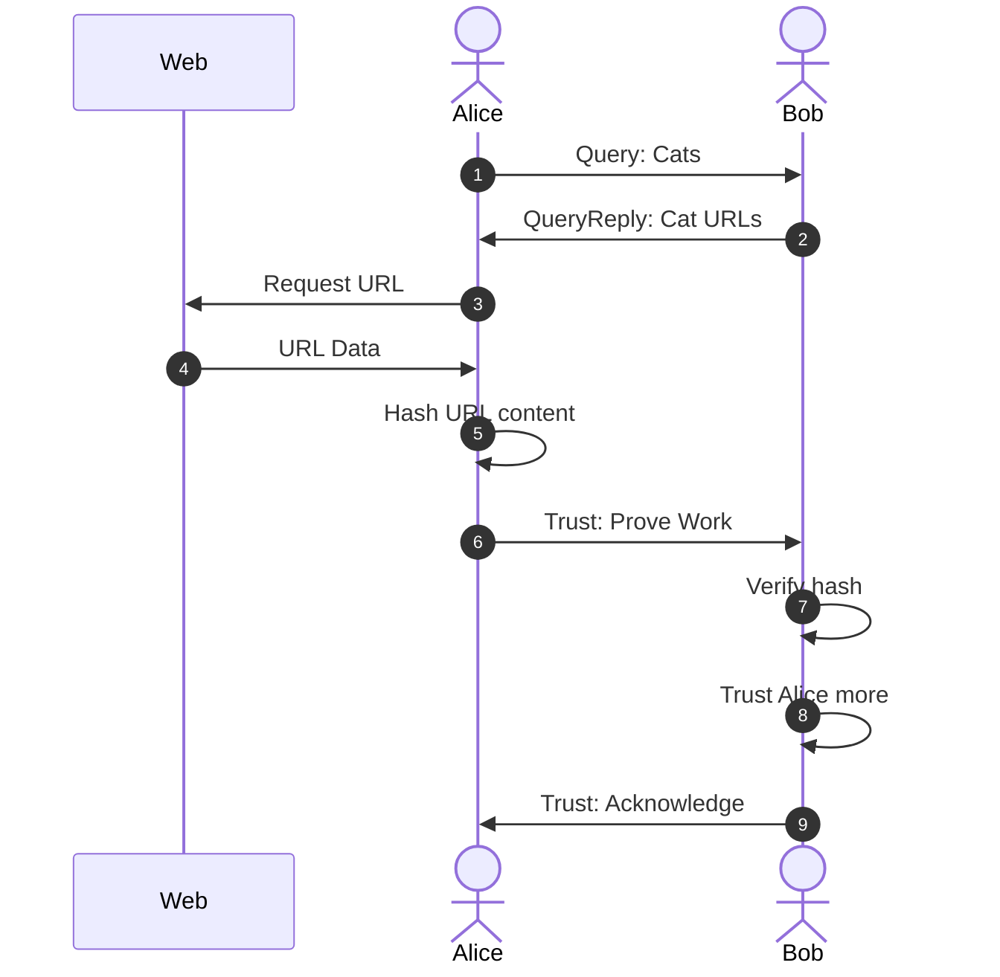
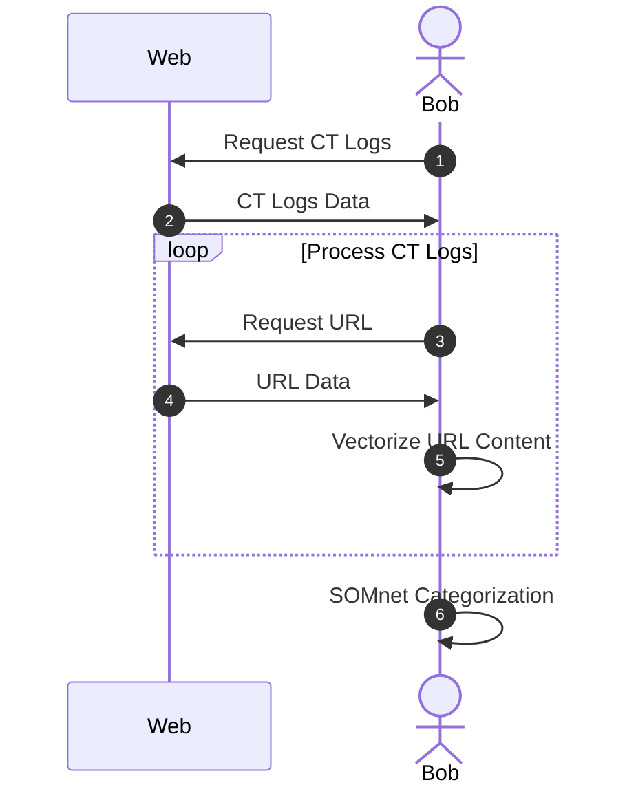
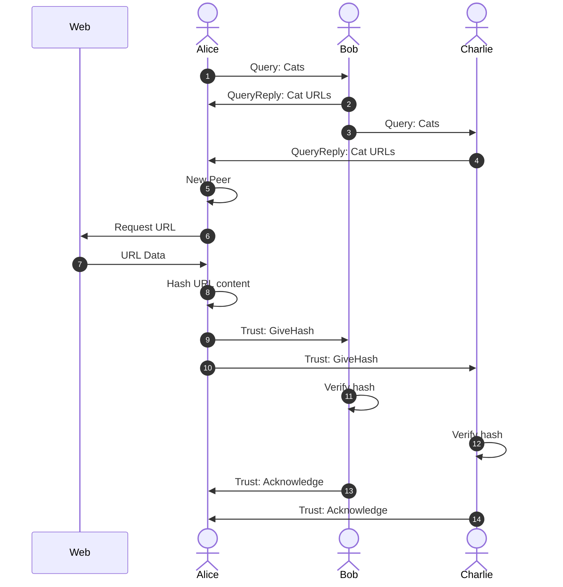

### Basic query

```mermaid
sequenceDiagram
    autonumber
    participant w as Web
    actor a as Alice
    actor b as Bob

    a->>b: Query: Cats
    b->>a: QueryReply: Cat URLs
    a->>w: Request URL
    w->>a: URL Data
    a->>a: Hash URL content
    a->>b: Trust: Prove Work
    b->>b: Verify hash
    b->>b: Trust Alice more
    b->>a: Trust: Acknowledge
```

### Basic crawling

```mermaid
sequenceDiagram
    autonumber
    participant w as Web
    actor b as Bob

    b->>w: Request CT Logs
    w->>b: CT Logs Data
    loop Process CT Logs
    b->>w: Request URL
    w->>b: URL Data
    b->>b: Vectorize URL Content
    end
    b->>b: SOMnet Categorization
```

### Deeper query

```mermaid
sequenceDiagram
    autonumber
    participant w as Web
    actor a as Alice
    actor b as Bob
    actor c as Charlie

    a->>b: Query: Cats
    b->>a: QueryReply: Cat URLs
    b->>c: Query: Cats
    c->>a: QueryReply: Cat URLs
    a->>a: New Peer

    a->>w: Request URL
    w->>a: URL Data
    a->>a: Hash URL content
    a->>b: Trust: GiveHash
    a->>c: Trust: GiveHash
    b->>b: Verify hash
    c->>c: Verify hash
    b->>a: Trust: Acknowledge
    c->>a: Trust: Acknowledge
```
